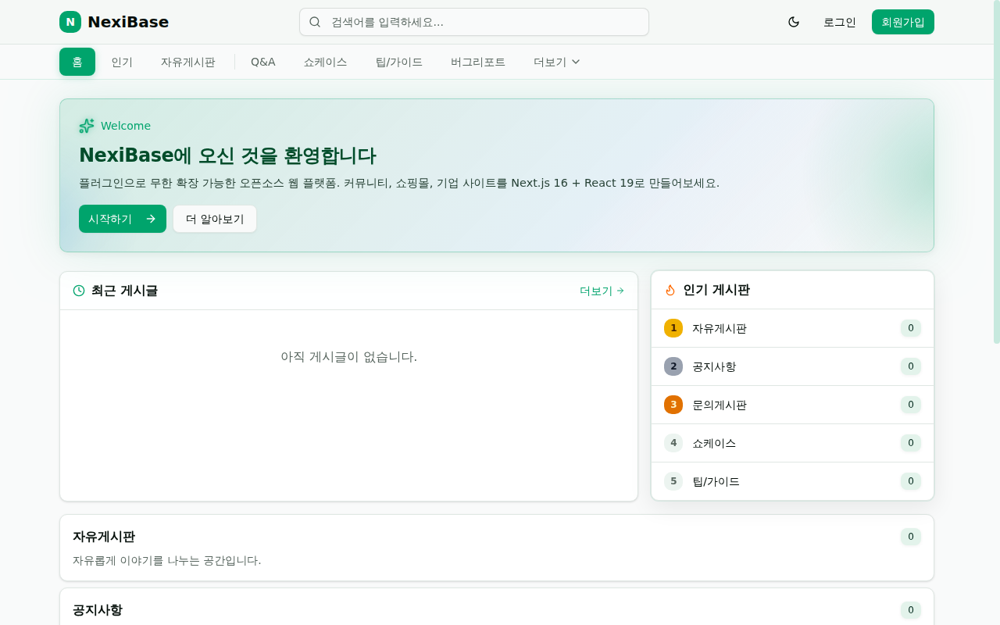
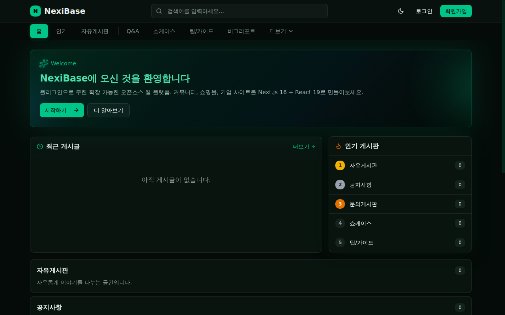

<div align="center">

# NexiBase

### Next.js 16 기반 오픈소스 풀스택 CMS

**플러그인 기반 · 테마 시스템 · 커뮤니티 퍼스트**

[](https://nextjs.org/)
[](https://react.dev/)
[](https://prisma.io/)
[](https://tailwindcss.com/)
[](LICENSE)

[라이브 데모](https://nexibase.com) · [빠른 시작](#빠른-시작) · [플러그인](#플러그인-시스템) · [English](#english)

</div>

---

<div align="center">

| 라이트 모드 | 다크 모드 |
|:---:|:---:|
|  |  |

</div>

## NexiBase란?

NexiBase는 커뮤니티, 쇼핑몰, 기업 사이트 등 무엇이든 만들 수 있는 오픈소스 셀프호스팅 CMS 플랫폼입니다.

플러그인 폴더를 넣으면 자동 인식. CSS 변수를 바꾸면 새 테마. 위젯을 드래그하면 홈페이지 완성.

> **NexiBase** = **Next.js** + **I** + **Base**
>
> *I*: Intelligence, Idea, Interface, Individual, Innovation

---

## 🚀 1분 설치 (Docker)

Docker만 있으면 명령어 한 줄로 바로 실행할 수 있습니다. MySQL도 자동으로 함께 뜹니다.

```bash
git clone --recurse-submodules https://github.com/nexibase/nexibase.git
cd nexibase
docker compose up -d
```

브라우저에서 **http://localhost:3000** 접속 → **첫 번째 가입자가 자동으로 관리자가 됩니다.**

```bash
docker compose logs -f app   # 로그 보기
docker compose down          # 중지
docker compose down -v       # 중지 + 데이터 삭제
```

> 프로덕션 배포 시에는 [`docker-compose.yml`](docker-compose.yml)의 `NEXTAUTH_SECRET`과 MySQL 비밀번호를 반드시 변경하세요.
> SMTP/OAuth/CAPTCHA 설정은 `.env` 파일을 만들고 compose의 `env_file` 주석을 해제하면 됩니다.

---

## 주요 기능

### 🧩 플러그인 시스템
- **폴더 기반** — `src/plugins/`에 폴더를 넣으면 자동 인식
- 플러그인별 Prisma 스키마, API 라우트, 관리자 페이지, 위젯, 메뉴 지원
- 관리자 대시보드에서 활성화/비활성화
- git submodule로 독립 관리 가능

### 🎨 테마 시스템
- CSS 변수 기반 테마 전환
- 서버사이드 로드 (깜빡임 없음)
- `custom.css`로 커스텀 테마 — 빌드 불필요
- 다크/라이트 모드 + 시스템 설정 감지

### 📦 위젯 시스템
- 12컬럼 그리드 홈페이지 레이아웃
- 관리자에서 드래그&드롭 위젯 배치 (상단/중앙/하단)
- 사이드바 위젯 (좌측/우측, 모든 페이지)
- 플러그인 위젯 자동 등록

### 📋 게시판 시스템 (기본 플러그인)
- 무제한 게시판 생성, 권한별 접근 제어
- 리치 텍스트 에디터 (Tiptap) + 이미지 드래그&드롭
- 댓글, 대댓글, 리액션
- 갤러리 뷰, 비밀글, 공지사항
- 전문 검색 (MySQL FULLTEXT)
- 파일 첨부 + 자동 이미지 처리 (Sharp → WebP)

### 👥 회원
- 이메일/비밀번호 + 소셜 로그인 (Google, Naver, Kakao)
- 이메일 인증
- 역할 기반 접근 제어 (사용자/운영자/관리자)

### ⚙️ 관리자 대시보드
- 회원 관리, 게시판 관리, 플러그인 관리
- 메뉴 관리 (Header/Footer, 트리 구조)
- 홈페이지 위젯 레이아웃
- 콘텐츠 페이지 (소개, FAQ 등)
- 사이트 설정 (테마, 레이아웃, 애널리틱스)

---

## 기술 스택

| 영역 | 기술 |
|------|------|
| 프레임워크 | Next.js 16, React 19 |
| 스타일링 | Tailwind CSS 4, shadcn/ui |
| 데이터베이스 | MySQL 8+ via Prisma ORM |
| 인증 | NextAuth.js (JWT + 세션) |
| 에디터 | Tiptap (리치 텍스트) |
| 이미지 | Sharp (리사이즈, WebP) |

---

## 빠른 시작

### 요구사항
- Node.js 18+
- MySQL 8.0+

### 1. 클론

```bash
git clone --recurse-submodules https://github.com/nexibase/nexibase.git
cd nexibase
```

### 2. 설치

```bash
npm install
```

### 3. 환경 설정

```bash
cp .env.example .env
# .env 파일에 MySQL 접속 정보 입력
```

### 4. 데이터베이스

```sql
CREATE DATABASE nexibase CHARACTER SET utf8mb4 COLLATE utf8mb4_unicode_ci;
```

```bash
npx prisma db push
```

### 5. 실행

```bash
npm run dev
```

http://localhost:3000 접속 → 설치 마법사가 자동으로 열립니다.

### 6. 설치 마법사

첫 실행 시 브라우저가 자동으로 `/install`로 이동합니다.

1. **언어 선택** — English 또는 한국어
2. **관리자 계정 + 사이트 정보**
   - 관리자 이메일 · 비밀번호 · 닉네임
   - 사이트 이름 · 사이트 설명 (선택)
3. **설치** 버튼 클릭 → 자동으로 seed 데이터(기본 게시판·메뉴·정책 등) 생성 → `/login`으로 이동

### 새 언어 추가하기

Nexibase는 드롭인 방식으로 언어를 확장할 수 있습니다. 파일 2개만 추가하면 됩니다:

```bash
# 1. src/locales/{locale}.json — en.json을 복사 후 번역
cp src/locales/en.json src/locales/ja.json
# 파일을 열어 모든 value를 일본어로 번역 (키 구조는 유지)

# 2. src/lib/install/seed-{locale}.ts — seed-en.ts를 복사 후 번역
cp src/lib/install/seed-en.ts src/lib/install/seed-ja.ts
# displayName과 모든 문자열 번역

# 3. 재시작 (scan-plugins가 자동으로 새 언어 등록)
npm run dev
```

이후 `/install` 페이지에 새 언어 버튼이 자동으로 등장합니다. 코드 수정 0줄.

### 설치 재설정 (개발 환경 전용)

테스트 목적으로 DB를 초기화하고 설치 마법사를 다시 실행하려면:

```bash
npm run reset-install -- --confirm
```

⚠️ 이 명령은 모든 users·boards·menus·widgets·contents·policies·settings와 shop 주문 데이터를 삭제합니다. `NODE_ENV=production`에서는 실행 거부됩니다. 리셋 후 dev 서버를 **재시작**해야 캐시가 초기화됩니다.

---

## 플러그인 시스템

플러그인은 `src/plugins/`의 독립 폴더입니다:

```
src/plugins/my-feature/
├── plugin.ts           # 플러그인 메타데이터
├── schema.prisma       # DB 모델
├── schema.user.prisma  # User 모델 관계 (자동 주입)
├── routes/             # 페이지 컴포넌트
├── api/                # API 엔드포인트
├── admin/              # 관리자 페이지 & API
├── widgets/            # 홈페이지 위젯
├── menus/              # 자동 등록 메뉴
└── header-widget.tsx   # 헤더 아이콘/위젯
```

**플러그인 추가:**

```bash
# git submodule로 추가
git submodule add https://github.com/nexibase/plugin-shop.git src/plugins/shop

# DB 동기화
npx prisma db push

# 재시작 → 자동 인식 → 관리자에서 활성화
npm run dev
```

### 제공 플러그인

| 플러그인 | 설명 | 상태 |
|---------|------|------|
| `boards` | 게시판, 게시글, 댓글 | 기본 내장 |
| `contents` | 콘텐츠 페이지 (소개, FAQ) | 기본 내장 |
| `policies` | 이용약관, 개인정보처리방침 | 기본 내장 |
| `shop` | 쇼핑몰 (상품, 장바구니, 주문) | Submodule |

---

## 프로젝트 구조

```
src/
├── app/              # 코어 라우트 + 자동생성 래퍼
├── plugins/          # 플러그인 시스템
│   ├── boards/       # 커뮤니티 (기본 내장)
│   ├── contents/     # 콘텐츠 (기본 내장)
│   ├── policies/     # 약관 (기본 내장)
│   └── shop/         # 쇼핑몰 (submodule)
├── layouts/          # 레이아웃 시스템 (Header, HomePage, Footer)
├── themes/           # 테마 시스템 (CSS 변수)
├── widgets/          # 독립 위젯
├── components/       # 공용 UI 컴포넌트
└── lib/              # 유틸리티
```

---

## 소셜 로그인 설정

<details>
<summary>Google</summary>

1. [Google Cloud Console](https://console.cloud.google.com/) → 프로젝트 생성
2. API 및 서비스 → 사용자 인증 정보 → OAuth 2.0 클라이언트 ID
3. 승인된 리디렉션 URI: `http://localhost:3000/api/auth/callback/google`
4. `.env`에 `GOOGLE_CLIENT_ID`, `GOOGLE_CLIENT_SECRET` 설정
</details>

<details>
<summary>Naver</summary>

1. [Naver Developers](https://developers.naver.com/) → 애플리케이션 등록
2. 서비스 URL: `http://localhost:3000`
3. Callback URL: `http://localhost:3000/api/auth/callback/naver`
4. `.env`에 `NAVER_CLIENT_ID`, `NAVER_CLIENT_SECRET` 설정
</details>

<details>
<summary>Kakao</summary>

1. [Kakao Developers](https://developers.kakao.com/) → 애플리케이션 추가
2. 카카오 로그인 활성화 → Redirect URI: `http://localhost:3000/api/auth/callback/kakao`
3. 동의항목에서 이메일 필수 설정
4. `.env`에 `KAKAO_CLIENT_ID` (REST API 키), `KAKAO_CLIENT_SECRET` 설정
</details>

---

## 기여하기

이슈, PR, 피드백 모두 환영합니다!

---

<a id="english"></a>

# English

## What is NexiBase?

NexiBase is an open-source, self-hosted CMS platform for building community sites, e-commerce, corporate websites, and more — all from a single codebase.

Drop a plugin folder → auto-detected. Override CSS variables → new theme. Drag widgets → custom homepage. That's the idea.

---

## 🚀 1-Minute Install (Docker)

All you need is Docker. One command starts NexiBase with a bundled MySQL.

```bash
git clone --recurse-submodules https://github.com/nexibase/nexibase.git
cd nexibase
docker compose up -d
```

Open **http://localhost:3000** — **the first signup becomes admin automatically.**

```bash
docker compose logs -f app   # tail logs
docker compose down          # stop
docker compose down -v       # stop + wipe data
```

> For production, change `NEXTAUTH_SECRET` and the MySQL password in [`docker-compose.yml`](docker-compose.yml).
> For SMTP / OAuth / CAPTCHA, create a `.env` file and uncomment the `env_file` section in compose.

---

## Features

### 🧩 Plugin System
- **Folder-based** — Drop a folder in `src/plugins/`, auto-detected
- Each plugin gets its own Prisma schema, API routes, admin pages, widgets, and menus
- Enable/disable from admin dashboard
- Plugins as git submodules — version and update independently

### 🎨 Theme System
- CSS variable-based theme switching
- Server-side loaded (no flash of unstyled content)
- Custom themes via `custom.css` — no build step needed
- Dark/light mode with system preference detection

### 📦 Widget System
- 12-column grid homepage layout
- Drag & drop widget placement (top / center / bottom zones)
- Sidebar widgets (left / right, all pages)
- Plugin widgets auto-registered

### 📋 Board System (Built-in Plugin)
- Unlimited boards with custom permissions
- Rich text editor (Tiptap) with image drag & drop
- Comments, threaded replies, reactions
- Gallery view, secret posts, pinned notices
- Full-text search (MySQL FULLTEXT)
- File attachments with auto image processing (Sharp → WebP)

### 👥 Members
- Email/password + social login (Google, Naver, Kakao)
- Email verification
- Role-based access (user / moderator / admin)
- Browser session management

### ⚙️ Admin Dashboard
- Member management
- Board management
- Plugin management (enable/disable, slug customization)
- Menu management (header/footer, tree structure)
- Homepage widget layout
- Content pages (about, FAQ, etc.)
- Site settings (theme, layout, analytics)

---

## Tech Stack

| Layer | Technology |
|-------|-----------|
| Framework | Next.js 16, React 19 |
| Styling | Tailwind CSS 4, shadcn/ui |
| Database | MySQL 8+ via Prisma ORM |
| Auth | NextAuth.js (JWT + session) |
| Editor | Tiptap (rich text) |
| Image | Sharp (resize, WebP) |

---

## Quick Start

### Requirements
- Node.js 18+
- MySQL 8.0+

### 1. Clone

```bash
git clone --recurse-submodules https://github.com/nexibase/nexibase.git
cd nexibase
```

### 2. Install

```bash
npm install
```

### 3. Configure

```bash
cp .env.example .env
# Edit .env with your MySQL credentials
```

### 4. Database

```sql
CREATE DATABASE nexibase CHARACTER SET utf8mb4 COLLATE utf8mb4_unicode_ci;
```

```bash
npx prisma db push
```

### 5. Run

```bash
npm run dev
```

Visit http://localhost:3000 — **first signup becomes admin automatically.**

---

## Plugin System

Plugins are self-contained folders in `src/plugins/`:

```
src/plugins/my-feature/
├── plugin.ts           # Plugin metadata
├── schema.prisma       # Database models
├── schema.user.prisma  # User model relations (auto-injected)
├── routes/             # Page components
├── api/                # API endpoints
├── admin/              # Admin pages & API
├── widgets/            # Homepage widgets
├── menus/              # Auto-registered menus
└── header-widget.tsx   # Header icon/widget
```

**Add a plugin:**

```bash
# As git submodule
git submodule add https://github.com/nexibase/plugin-shop.git src/plugins/shop

# Sync database
npx prisma db push

# Restart → auto-detected → enable in admin
npm run dev
```

### Available Plugins

| Plugin | Description | Status |
|--------|------------|--------|
| `boards` | Community boards, posts, comments | Built-in |
| `contents` | Content pages (about, FAQ) | Built-in |
| `policies` | Terms, privacy policy | Built-in |
| `shop` | E-commerce (products, cart, orders) | Submodule |

---

## Project Structure

```
src/
├── app/              # Core routes + auto-generated wrappers
├── plugins/          # Plugin system
│   ├── boards/       # Community (built-in)
│   ├── contents/     # Content pages (built-in)
│   ├── policies/     # Policies (built-in)
│   └── shop/         # E-commerce (submodule)
├── layouts/          # Layout system (Header, HomePage, Footer)
├── themes/           # Theme system (CSS variables)
├── widgets/          # Standalone widgets
├── components/       # Shared UI components
└── lib/              # Utilities
```

---

## Documentation

- [Plugin Development Guide](docs/superpowers/specs/2026-04-06-plugin-architecture-design.md)
- [Theme Customization](#theme-system)
- [Widget System](#widget-system)

---

## Social Login Setup

<details>
<summary>Google</summary>

1. [Google Cloud Console](https://console.cloud.google.com/) → Create project
2. APIs & Services → Credentials → OAuth 2.0 Client ID
3. Redirect URI: `http://localhost:3000/api/auth/callback/google`
4. Set `GOOGLE_CLIENT_ID` and `GOOGLE_CLIENT_SECRET` in `.env`
</details>

<details>
<summary>Naver</summary>

1. [Naver Developers](https://developers.naver.com/) → Register app
2. Service URL: `http://localhost:3000`
3. Callback URL: `http://localhost:3000/api/auth/callback/naver`
4. Set `NAVER_CLIENT_ID` and `NAVER_CLIENT_SECRET` in `.env`
</details>

<details>
<summary>Kakao</summary>

1. [Kakao Developers](https://developers.kakao.com/) → Add app
2. Enable Kakao Login → Redirect URI: `http://localhost:3000/api/auth/callback/kakao`
3. Set email as required in consent items
4. Set `KAKAO_CLIENT_ID` (REST API key) and `KAKAO_CLIENT_SECRET` in `.env`
</details>

---

## Contributing

Contributions welcome! Open an issue, submit a PR, or just say hi.

---

## License

[MIT](LICENSE)

---

<div align="center">

**[nexibase.com](https://nexibase.com)** · **[GitHub](https://github.com/nexibase/nexibase)**

</div>
